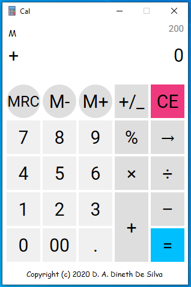

# Cal
Simple calculator
 

- This standard calculator is made up with C#.net and WPF framework.
- This has two versions, one supporting .net framework 4.8 and another supporting .net framework 4
- This has custermized buttons and some other controlers instead of standard wpf controlers to get a new look.
- This is standard and **does not use BODMAS rule at all**.
- In this calculator you can use numbers *from ±1.0 x 10-28 to ±7.9228 x 1028* for any operation.
- If you try to use a number out of the range the calculator will output an error sound.
## All tasks that the calculator can done
1. Simple operations
> - Addition
> - Substraction
> - Multiplication
> - Divition
2. Memory handling
> - MRC
> - M+
> - M-
3. Calculating of percentages
